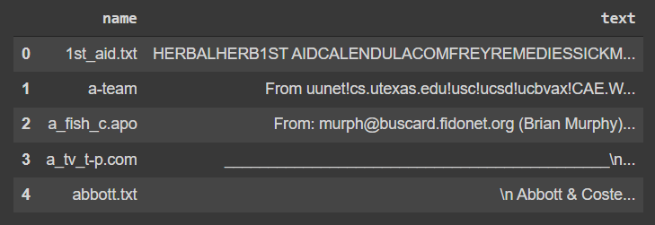

## CCSE508: Information Retrieval
# Assignment 1

### Group- 76
Kshitij Mohan (2019054) - (Github: Kshitij-M)
Shreya Tomar (2019110)  - (Github: Shreya0229)

TA assigned- Deepi Garg - (Github: deepigarg)

## Q1. 
Preprocessing: We have followed the following steps for preprocessing:
- We have read all the text files using utf-8 encoding and ignored all the errors in reading the same.
- First step of processing starts by converting all the text to lower case.
- This is followed by removing all the punctuations - """˛şË›ÃºÅŸ§ż±ŕőíä°üß!"#$%&\'()*+,-./:;<=>?@[\\]^_`{|}~ \t\n\r\x0b\x0c"""
- This is followed by removing English stop words.
- The final step of preprocessing is lemmatization.

#### Before Preprocessing:

#### After Preprocessing:

#### Unigram Inverted Index Data Structure:
We have implemented this data structure using a dictionary. We simply iterate thorugh the documents (which are already sorted in ascending order) and store the indexes of documents for every word in the corpus in a set. As the order of documents is increasing, the resulting documents are also sorted in ascending order which makes if more efficient while performing union or intersection operations.

Finally, We merge the sets according to the input queries and operations. ‘NOT’ operations are done first followed by ‘AND’ and ‘OR’ operations.
The results of the given inputs are as follows:

#### Duplicate Runtime:
Upload zip file of the dataset.
Run all the cells.

#### Q2. 
I have read all the files given in the dataset. For preprocessing, firstly all the text is converted to lower case text. It is then tokenized using Tweektokenizer and the stopwords are removed form it. The punctuations like bracket, comma, semicolon, colon, etc. are removed. Then it is stripped and any black space token available are removed. 

The positional index data structure is created using a dictionary and lists by enumerating the tokens which we have got after preprocessing.

 
The query is taken as input from the user. The support for the query which is a phrase query is done. If the length of the query word after preprocessing the query word is 1 then only the single word is used to retrieve the documents. 
On the other hand, if we have more than one word in the query after preprocessing the query word, then for each of these consecutive words the documents are retrieved as shown in the code. 

The output is the number of documents retrieved and the list of document names retrieved.
For example, 

